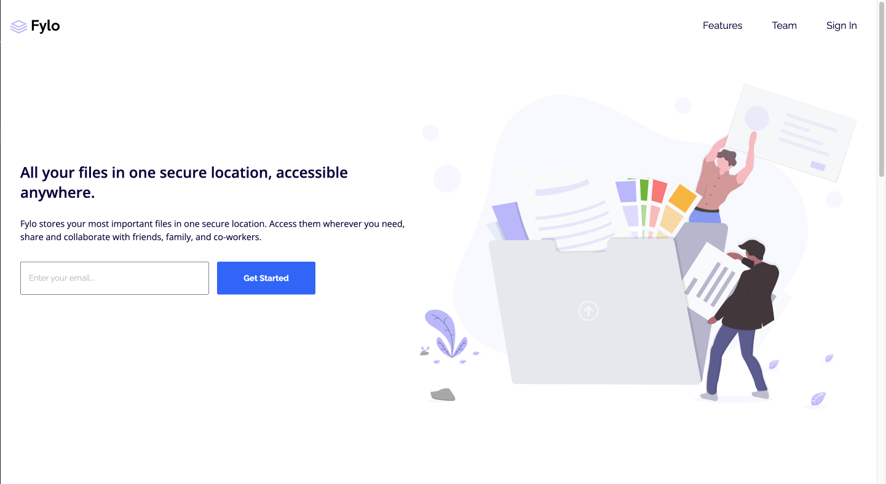

# Frontend Mentor - Fylo landing page with two column layout solution

This is a solution to the [Fylo landing page with two column layout challenge on Frontend Mentor](https://www.frontendmentor.io/challenges/fylo-landing-page-with-two-column-layout-5ca5ef041e82137ec91a50f5). Frontend Mentor challenges help you improve your coding skills by building realistic projects. 

## Table of contents

- [Overview](#overview)
  - [The challenge](#the-challenge)
  - [Screenshot](#screenshot)
  - [Links](#links)
- [My process](#my-process)
  - [Built with](#built-with)
  - [What I learned](#what-i-learned)
  - [Continued development](#continued-development)
  - [Useful resources](#useful-resources)
- [Author](#author)


## Overview
 This project was my very first junior frontend mentor project. It was a very nice challenge and I found my self gliding through it for this most part. I couldnt have imagined doing that 3-6 months ago. I did have an unresolved issue with this project though when it comes to the active states. I'm hoping to gain insight on ways to resolve the issue after submitting it on frontend mentor.
### The challenge

Users should be able to:

- View the optimal layout for the site depending on their device's screen size
- See hover states for all interactive elements on the page

### Screenshot
 Here are some screenshots of the finished project



### Links

- Solution URL: [Solution](https://your-solution-url.com)
- Live Site URL: [Live Site](https://hazel-black.github.io/fylo-landing-page-with-two-column-layout-master/)

## My process

### Built with

- HTML5 
- CSS custom properties
- Flexbox
- Mobile-first workflow


### What I learned
I took time on this project to go back to the basics and learn about the nav element. I also did research on the ul/ol,li and a element as well. to make this project a bit more semantic i used navigation in both the header and the footer since they both contained navigation link for the static page. here is a snapshot of that code.

```html
        <div class="column">
          <nav>
            <ul>
              <li><a href="#">About Us</a></li>
              <li><a href="#">Jobs</a></li>
              <li><a href="#">Press</a></li>
              <li><a href="#">Blog</a></li>
            </ul>
          </nav>
        </div>
        <div class="column">
          <nav>
            <ul>
              <li><a href="#">Contact Us</a></li>
              <li><a href="#">Terms</a></li>
              <li><a href="#">Privacy</a></li>
            </ul>
          </nav>
        </div>
```
also I did some experimenting with the background images, up until this point i had always just used bacground-size: cover or contains. However for this project i defined a width and height for the background image. here is a snap shot of the code for both mobile and desktop.

```css
  .middle-section {
    background-image: url(images/bg-curve-desktop.svg);
    background-size: 240% 45em;
  }

```

```css
.middle-section {
  background: url(images/bg-curve-mobile.svg) no-repeat bottom center;
  background-size: 110em 55em;
  width: 100%;
  height: 100%;
  text-align: left;
  padding-bottom: 5em;
  display: flex;
  flex-direction: column;
  justify-content: center;
  align-items: center;
}
```

### Continued development


During this project I couldn't figure out how to get the error message to only pop up when the email address on the form is filled in incorrectly. I stuggled for hours to find the solution for doing this with only HTML and CSS but most resolutions envolved JS. I have decided to submit the project and gain advice from others in the community to learn from this. I hope that once I have the solution I can update the project with the proper code. I also love the junior projects on frontend mentor and plan on completing all of the free ones.
### Useful resources

- [W3Schools: HTML List](https://www.w3schools.com/html/html_lists.asp) 
- [MDN: Form Validation](https://developer.mozilla.org/en-US/docs/Learn/Forms/Form_validation)


## Author

- Frontend Mentor - [@Hazel-Black](https://www.frontendmentor.io/profile/Hazel-Black)


